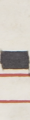
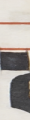
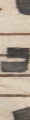

# XML Parser to Dataset Image Extraction

This repository is being used to extract individual images of neumes and neume components in a staff. The images will then be passed into a model for training simultaneously on neume and pitch classification. Model training will be performed in another repository: omr-position-classification.

## Current Worklow

The *Interactive Classifier* job on Rodan is useful for quickly adding labels to neumes and neume components. It is usually used to manually classify a few neume types and automatically assess the rest based on a deep learning process. For the dataset extraction envisioned in this repository, I am using the *Interactive Classifier* to instead classify on neume position. The model cannot classify neume position automatically, though the workflow will be extended in the future to encompass automatic pitch classification and encode it in an xml format. I delete any glyphs that are not neumes, but are caught by the classifier. 

After exporting the xml file containing all the neume coordinates and position labels, I use a python script **bounding-box-extraction.py** to parse the xml file and save individual images of each neume component from the original image of the manuscript page. Y-coordinates are extended above and below the original bounding box to encapsulate a portion of the staff lines found around the neume. Then, each image is interpolated and resized to 30 x 120 pixels for standardization purposes in the dataset. Below are a few examples of images found in the dataset.

s5                            | s1                           | s3
:----------------------------:|:----------------------------:|:----------------------------:
 | | 

## {Deprecated Workflow}

Initially, I am taking an image of a score with the staves isolated (no lyrics or neumes), and I am passing it into the Rodan "Miyao Staff Finding" workflow to receive the bounding boxes for each stave on the page. The file is output as a JSOMR file, and I am currently using <https://codebeautify.org/jsontoxml> to convert it to XML since the JSOMR2MEI job on rodan is not generalized to files that do not have "glyph" tags. I realize JSOMR can also be parsed, MEI is more standardized in our general software programs. All of the current MEI (XML) information on the Salzinnes pages is included in this repository using the method described.

Next, **stave-parser.py** asks for a numerical input from the Salzinnes images (10-18) to use for stave isolation. Using the XML coordinates from above, the respective page is split into images of each of the individual staves. Additionally, the same cooridnates are used to extract bounding boxes of the staves from the isolated layers of the Salzinnes pages, particularly the glyphs and staves layers. Respectively, these splits are saved in three folders not included in the repo due to size concerns:

* stave_boxes (full color image from original size to individual stave)
* stave_boxes_glyphs (same size as stave boxes, only glyphs in image)
* stave_boxes_lines (same size as stave boxes, only respective stave in image)

**image-extraction.py** is then used to extract the images of each individual neume and neume component in the staff. Taking a few user input parameters, you specify which staff to parse, and a few parameters pertaining to erosion and line finding processes using the opencv library. Erosion is used on a greyscale of the original stave image, reducing the now whitespace of each neume to a point where neume components are consistently (little errors) isolated from one another successfully, allowing for their coordinates to be used for writing images of their position in the original image. Each image is also resized to the same dimensions with the intention of passing them into the model down the road. 
